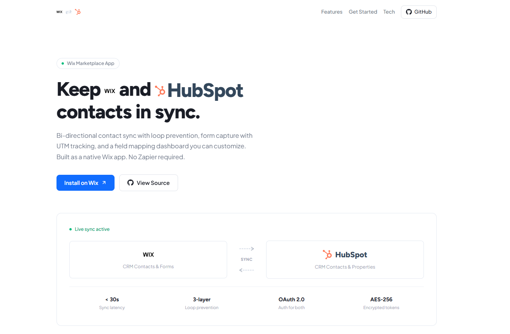
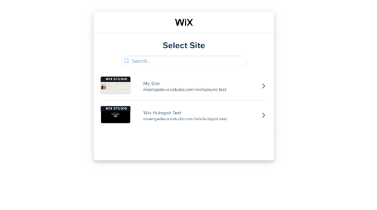
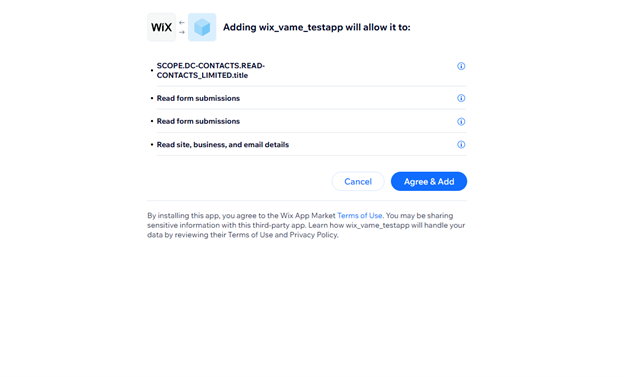
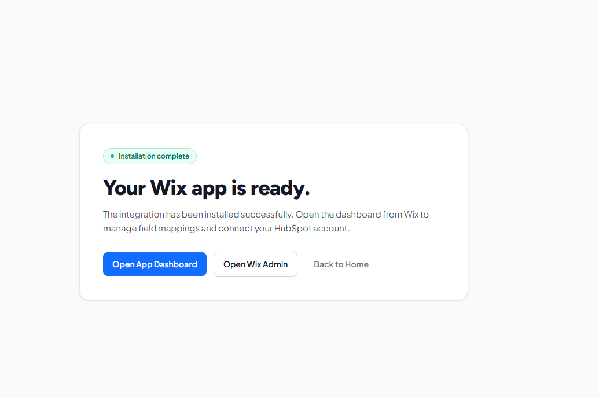
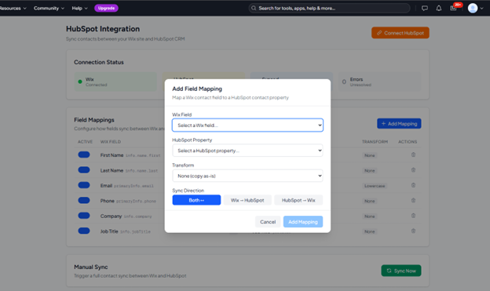
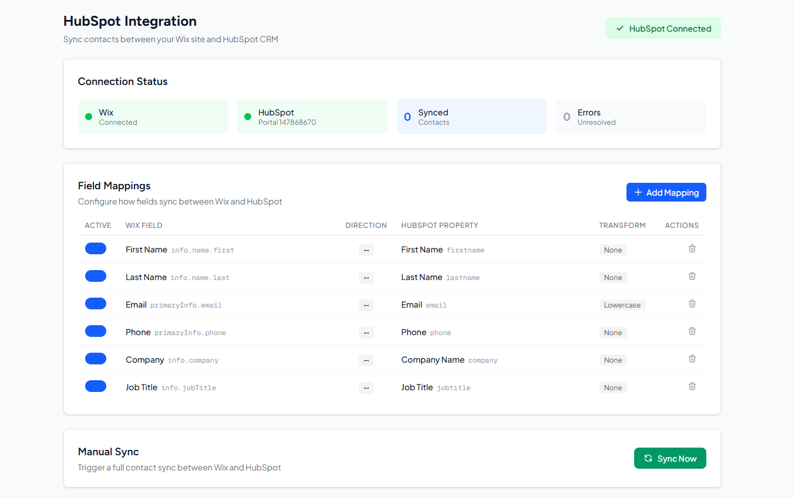

# Wix ↔ HubSpot Integration - Deliverables

**Assignment:** Vame Ltd - App Market Full Stack Assignment
**Developer:** Daniel Moenga
**Date:** February 2026

---

## Deliverable 1: API Plan

**Document:** [`docs/api-plan.md`](./api-plan.md)

Covers which APIs are connected for each feature and how they interact:

### Feature #1 - Bi-directional Contact Sync

| Side | API Used | Endpoints |
|------|----------|-----------|
| **Wix** | Contacts REST API v4 | `GET /contacts/{id}`, `POST /contacts`, `PATCH /contacts/{id}`, `POST /contacts/query` |
| **HubSpot** | CRM Contacts API v3 | `GET /crm/v3/objects/contacts/{id}`, `POST /crm/v3/objects/contacts`, `PATCH /crm/v3/objects/contacts/{id}`, `POST /crm/v3/objects/contacts/search` |
| **Wix → App** | Webhooks (JWT-signed) | `wix.contacts.v4.contact_created`, `wix.contacts.v4.contact_updated` |
| **HubSpot → App** | Webhooks (HMAC-signed) | `contact.creation`, `contact.propertyChange` |

The sync engine uses a three-layer loop prevention system:
1. **Event dedup** - Each webhook event ID is checked against a TTL collection (24h expiry)
2. **Echo suppression** - If we pushed data to platform B within the last 5 seconds, we suppress the incoming echo webhook from B
3. **Data change detection** - Compare incoming field values vs. current target values; skip if identical

### Feature #2 - Form & Lead Capture with UTM Attribution

| Side | API Used | Purpose |
|------|----------|---------|
| **Wix** | Forms Submissions API | Receives `wix.forms.v4.form_submitted` webhook |
| **HubSpot** | CRM Contacts API v3 | Upserts contact with form data + UTM properties |
| **HubSpot** | Properties API v3 | Creates custom `utm_source`, `utm_medium`, `utm_campaign`, `utm_term`, `utm_content` properties on first HubSpot connection |

UTM parameters are extracted from the page URL where the form was submitted. Form field names are matched to HubSpot properties using heuristic matching (e.g., "Your Email" → `email`, "Full Name" → `firstname` + `lastname`).

### Feature #3 - OAuth 2.0 Security

| Platform | Flow | Token Expiry |
|----------|------|-------------|
| **Wix** | OAuth (Client Credentials, with Authorization Code fallback) | 4 hours |
| **HubSpot** | Authorization Code Grant | 30 minutes (auto-refresh) |

Tokens are encrypted at rest using AES-256-CBC before storage in MongoDB. HMAC-SHA256 signed state parameters prevent CSRF during OAuth flows.

### Feature #4 - Field Mapping Dashboard

| API | Purpose |
|-----|---------|
| `GET /api/mappings` | Fetch current field mappings for an installation |
| `POST /api/mappings` | Create new field mapping |
| `PUT /api/mappings` | Update existing mapping (change direction, transform, active state) |
| `DELETE /api/mappings` | Remove a mapping |
| `GET /api/fields/wix` | List all Wix contact fields (label + key) |
| `GET /api/fields/hubspot` | List all HubSpot contact properties (label + name) |

The dashboard is embedded as an iframe inside the Wix site admin panel.

---

## Deliverable 2: Working Integration

**Live URL:** https://wix-hubspot-integration-vame.vercel.app

### What's Built

| Component | Files | Description |
|-----------|-------|-------------|
| **OAuth Flows** | 4 API routes | Wix install + callback, HubSpot connect + callback |
| **Webhook Receivers** | 3 API routes | Wix contact events, Wix form submissions, HubSpot contact events |
| **Dashboard API** | 6 API routes | Field mappings CRUD, Wix/HubSpot field lists, sync trigger, sync status, installation status |
| **Dashboard UI** | 8 React components | Connection status, HubSpot connect button, field mapping table, add mapping modal, sync status panel |
| **Sync Engine** | 1 service | Bi-directional sync with 3-layer loop prevention, field-level last-write-wins conflict resolution |
| **Field Mapper** | 1 service | Transform pipeline (identity, lowercase, uppercase, date_format, enum_map) |
| **Form Capture** | 1 service | UTM extraction, heuristic field matching, HubSpot contact upsert |
| **Crypto Utils** | 1 utility | AES-256-CBC encrypt/decrypt, HMAC-SHA256 state signing |
| **Webhook Verification** | 1 service | JWT verification for Wix, HMAC-SHA256 v3 + v1 fallback for HubSpot |

### Tech Stack

- **Framework:** Next.js 16 (App Router, TypeScript)
- **Database:** MongoDB Atlas (5 collections with TTL indexes)
- **Hosting:** Vercel (serverless functions, edge network)
- **Testing:** Vitest - 89 unit tests passing
- **Styling:** Tailwind CSS v4

### Post-install UX

The install flow now includes a dedicated success handoff for manual installs:

- `GET /install/success` confirms installation and gives clear next actions.
- Landing/manual install detection uses a short-lived `wix_install_entry=landing` server cookie marker so Wix receives the exact registered callback URL.
- Success page actions:
  - Open app dashboard (`/dashboard?instanceId=...`)
  - Open Wix Admin (`https://manage.wix.com/dashboard/sites`)
  - Return home with success banner (`/?installed=1&instanceId=...`)
- Home page banner (`installed=1`) gives a visible "you're good to continue" state for returning users.

---

## Deliverable 3: GitHub Repository

**Repository:** https://github.com/Daniel-Moenga/wix-hubspot-sync-vame

```
wix-hubspot-integration/
├── docs/
│   ├── api-plan.md              # Full API plan document
│   ├── deliverables.md          # This file
│   └── screenshots/             # Install walkthrough images
├── src/
│   ├── app/
│   │   ├── api/auth/            # 4 OAuth routes
│   │   ├── api/webhooks/        # 3 webhook receivers
│   │   ├── api/mappings/        # Field mapping CRUD
│   │   ├── api/fields/          # Wix + HubSpot field lists
│   │   ├── api/sync/            # Manual sync trigger + status
│   │   ├── api/installation/    # Installation status
│   │   ├── dashboard/           # UI components (8 files)
│   │   ├── layout.tsx
│   │   └── page.tsx             # Landing page
│   ├── lib/
│   │   ├── db.ts                # MongoDB connection singleton
│   │   ├── services/            # Core business logic (8 files)
│   │   └── utils/               # Crypto, logger, errors, constants
│   └── types/                   # TypeScript type definitions (4 files)
├── tests/unit/                  # 89 unit tests (6 test files)
├── .env.example                 # All 10 required env vars documented
├── vercel.json                  # Function timeout config
├── vitest.config.ts
├── package.json
└── README.md
```

---

## Deliverable 4: Test Credentials

### Wix Test App

| Field | Value |
|-------|-------|
| **App ID** | `6ebb052f-b4f3-468e-b7e4-c143d267f589` |
| **App Dashboard** | Available in Wix Dev Center under the developer account |

To test the app: Install it on any Wix site → it will trigger the OAuth flow → the dashboard loads inside the Wix admin panel.

### HubSpot Test App

| Field | Value |
|-------|-------|
| **App ID** | `32086924` |
| **Client ID** | `8b457616-7b71-4a7a-a75a-d03baff44137` |

To test: Click "Connect HubSpot" in the Wix dashboard → authorize with a HubSpot account → contacts start syncing.

### Testing Account

| Platform | Access |
|----------|--------|
| **Wix Developer Account** | (provided separately) |
| **HubSpot Developer Account** | (provided separately) |
| **Vercel Deployment** | https://wix-hubspot-integration-vame.vercel.app |
| **GitHub** | https://github.com/Daniel-Moenga |

---

## How to Test End-to-End

1. **Install on Wix:** Open a Wix site dashboard → Add Apps → Find the custom app → Install → OAuth flow completes automatically
2. **Connect HubSpot:** In the app's dashboard panel inside Wix, click "Connect HubSpot" → Authorize → Connection established
3. **Test Contact Sync (Wix → HubSpot):** Create a new contact in Wix CRM → Within 30 seconds, it appears in HubSpot
4. **Test Contact Sync (HubSpot → Wix):** Create a contact in HubSpot → Within 30 seconds, it appears in Wix CRM
5. **Test Loop Prevention:** Update a synced contact → Confirm no infinite sync loop (check processed_events collection)
6. **Test Form Capture:** Submit a Wix form on a page with `?utm_source=test&utm_campaign=demo` in the URL → Verify HubSpot contact has UTM properties populated
7. **Test Field Mapping:** In the dashboard, add/edit/delete a field mapping → Verify it persists and affects future syncs

---

## Automated Validation

- `npm test` ran successfully: **6 test files**, **89 tests**, all passing.
- `npm run build` ran successfully on **Next.js 16.1.6** with production build output generated.
- Validation was run after the Wix OAuth redirect hotfix and docs walkthrough updates.

---

## Install & Access Walkthrough

### 1) Landing page install entry



User starts installation from the public landing page via **Install on Wix**.

### 2) Select Wix site



Wix prompts the user to choose which site should receive the app.

### 3) Review permissions and approve



User confirms requested scopes and clicks **Agree & Add**.

### 4) Installation complete page



After the Wix install flow completes, users land on the success page with direct actions to open the app dashboard, Wix admin, or return home.

### 5) Open installed app dashboard



The Wix app dashboard opens with connection status, mappings, and manual sync controls available.

### 6) Connect HubSpot from the dashboard



After clicking **Connect HubSpot** and completing OAuth, both systems show connected and the field mapping table is ready for sync tuning.

---

## Comparison to Klaviyo for Wix (Inspiration)

The assignment referenced Klaviyo for Wix as inspiration for UX around connecting accounts, mapping fields, and syncing reliably without Zapier. Here's how this integration compares:

| Capability | Klaviyo for Wix | This Integration |
|-----------|----------------|------------------|
| Account connection | OAuth popup | OAuth popup (both Wix + HubSpot) |
| Field mapping | Visual mapper | Visual mapper with direction + transform control |
| Sync direction | One-way (Wix → Klaviyo) | Bi-directional (Wix ↔ HubSpot) |
| Real-time sync | Webhook-based | Webhook-based with 3-layer loop prevention |
| Form capture | Basic | Full UTM attribution tracking |
| Manual sync | Not available | "Sync Now" button for full reconciliation |
| Loop prevention | N/A (one-way) | Event dedup + echo suppression + data change detection |
| Token security | Standard | AES-256-CBC encryption at rest |
| Dashboard | Embedded | Embedded in Wix admin as iframe |

This implementation goes beyond a Klaviyo-style integration by supporting full bi-directional sync with sophisticated loop prevention - which is the hardest engineering problem in sync systems.
